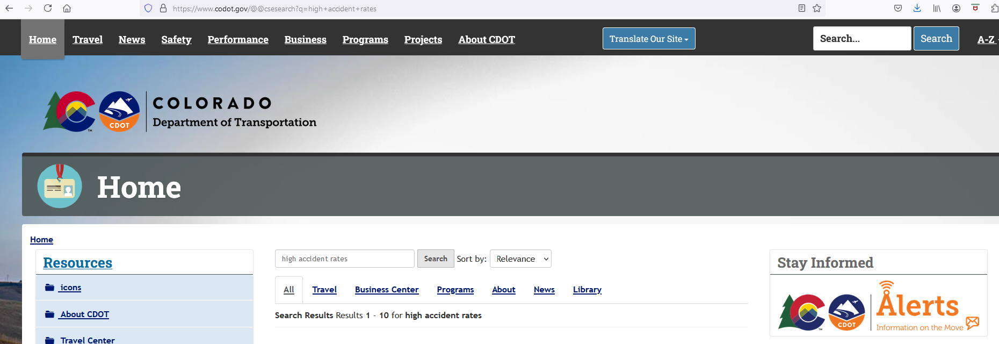

#     Exploratory Data Analysis - Project Team 6
#     Traffic Crashes Classification and Prediction  
#     Project 3 

## Overview

Traffic Safety, is the selected focus for our project.  Specifically, we're focused on the accidents that occur in the state of Colorado.  Our dataset is one from Kaggle, the "US-Accidents: A Countrywide Traffic Accident Dataset".  https://www.kaggle.com/datasets/sobhanmoosavi/us-accidents
Our dataset has 7.7 million records, covering 49 states, omitting just Hawaii.  However, an analysis reveals that there isn't any data for Alaska either. This dataset was initially published in 2019 by Sobhan Moosavi, a Data Scientist at Lyft, Inc.  Sobhan's CV can be obtained at https://smoosavi.org/cv/ .  The dataset contains crash data starting from February, 2019 through March, 2023. The data is generated continously via multiple APIs that provide streaming traffic event data from serveral enties such as US and state department of transportation, law enforcement agencies, traffic cameras, and traffic sensors within road networks.  https://smoosavi.org/datasets/us_accidents .

## Acknowledgements 

The following two papers are being cited as a condition for our academic use of this dataset. 

    Moosavi, Sobhan, Mohammad Hossein Samavatian, Srinivasan Parthasarathy, and Rajiv Ramnath. “A Countrywide Traffic Accident Dataset.”, arXiv preprint arXiv:1906.05409 (2019).

    Moosavi, Sobhan, Mohammad Hossein Samavatian, Srinivasan Parthasarathy, Radu Teodorescu, and Rajiv Ramnath. “Accident Risk Prediction based on Heterogeneous Sparse Data: New Dataset and Insights.” In proceedings of the 27th ACM SIGSPATIAL International Conference on Advances in Geographic Information Systems, ACM, 2019.

The dataset is distributed under the following license:  Creative Commons Attribution-Noncommercial-ShareAlike license (CC BY-NC-SA 4.0).

### Focused State of Analysis - Colorado

As mention earlier, our dataset encompases the continental United States containing 7.7 million records.  We have selected a subgroup for our analysis, focusing only on the data representing The State of Colorado.  Although the data comprising just Colorado is reduce down to 90885 records, we feel this still should provide a good amount of data to perform our goals, while limiting the amount of data to a manageable size. 

In addition to our Kaggle dataset described above, we may use information from Colorado Department of Transportation's (CODOT) website shown above.  Their website link is  https://www.codot.gov/@@csesearch?q=high+accident+rates

Information may be gleaned from CODOT to cooborate information learned per the Kaggle dataset. 

## Questions

The goal or questions we aim to answer, gleened from our intial review of the columns within our selected dataset are...

     o  Determine the best model configurations to predict crashes
     o  Identify the different classifications of crashes and potentially the impact within each 
     o  Ultimately, using our model(s) here,  CODOT could identify road improvement prospects for improved safety  
 
     

## Further Exploration

Work towards identifying the model scores and improvement thereof will continue. There are quite a few interesting columns in this dataset which may contribute or hinder this effort. Of course it is all in the details.  

# Summary

This concludes the EDA at this point and will be incorporated into our final presentation.

 

